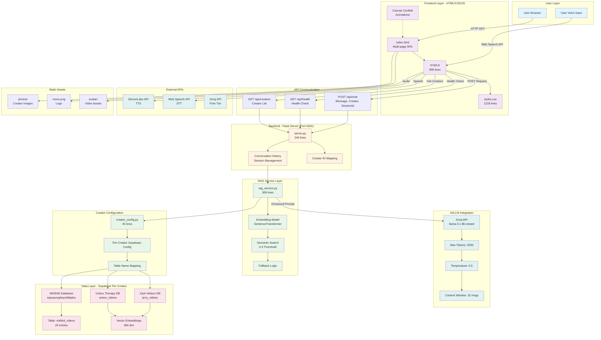
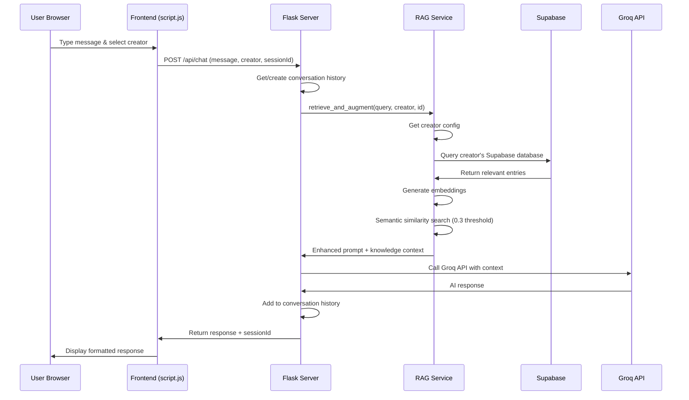
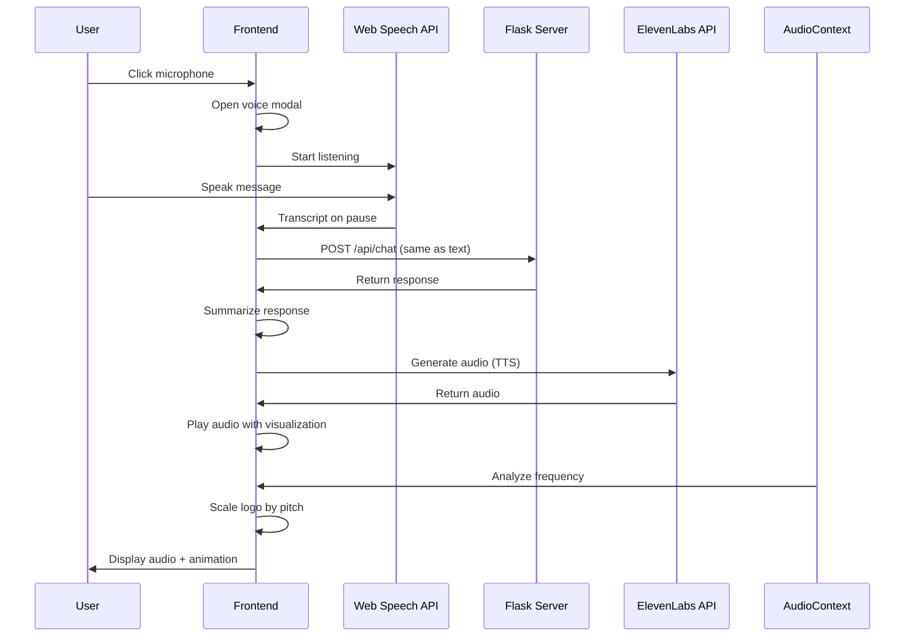
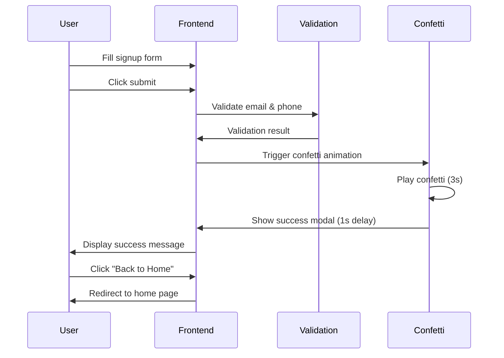

# Monetizer.ai - System Architecture Diagram

## Overview
This document presents the complete system architecture for Monetizer.ai, an AI-powered creator platform that connects users with AI personas of YouTube creators for product recommendations and monetized conversations.

---

## System Architecture Diagram



---

## Data Flow Diagrams

### 1. User Chat Flow



### 2. Voice Chat Flow



### 3. Creator Registration Flow



---

## Component Details

### 1. Frontend Components

| Component | File | Lines | Purpose |
|-----------|------|-------|---------|
| HTML Structure | `index.html` | 206 | Multi-page SPA with Home, Creator Selection, Chat, and Signup pages |
| JavaScript Logic | `script.js` | 990 | Navigation, search (Trie), chat, voice, confetti, form validation |
| Styling | `styles.css` | 1218 | Dark mode UI, animations, responsive design, cyan theme |

**Key Features:**
- Trie-based autocomplete for creator search
- Real-time audio visualization with pitch detection
- Confetti animations for celebrations
- Form validation with regex
- Typewriter effect for streaming responses
- Markdown parsing for AI responses

### 2. Backend Components

| Component | File | Lines | Purpose |
|-----------|------|-------|---------|
| Flask Server | `server.py` | 246 | API endpoints, conversation management |
| RAG Service | `rag_service.py` | 369 | Knowledge retrieval, embeddings, semantic search |
| Creator Config | `creator_config.py` | 45 | Per-creator Supabase configuration |

**Key Features:**
- Session-based conversation context
- Per-creator isolated knowledge bases
- Fallback responses when no knowledge found
- CORS enabled for frontend communication

### 3. Data Layer

| Creator | Database | Table | Entries |
|---------|----------|-------|---------|
| Marques Brownlee | xqswazwghqvofdkjalxx | mkbhd_videos | 26 |
| Zack Nelson | jerry_videos | jerry_videos | TBD |
| Unbox Therapy | unbox_videos | unbox_videos | TBD |

**Schema:**
- `id`: Serial PRIMARY KEY
- `title`: TEXT
- `content`: TEXT
- `embedding`: VECTOR(384) - sentence-transformers dimension
- `similarity_score`: FLOAT

### 4. External Services

| Service | Purpose | Configuration |
|---------|---------|---------------|
| Groq API | LLM inference | Model: llama-3.1-8b-instant, Max tokens: 2000, Free tier: 14,400 req/day |
| ElevenLabs | Text-to-Speech | Voice ID: 5Q0t7uMcjvnagumLfvZi (Male) |
| Web Speech API | Speech-to-Text | Browser-based, no configuration needed |
| Supabase | Database | Per-creator instances with REST API |

---

## System Requirements

### Performance Metrics
- **Chat Response Time**: < 3 seconds
- **Voice Response Time**: < 5 seconds
- **Vector Search**: < 500ms
- **Audio Visualization**: 60 FPS

### Technology Stack
- **Frontend**: HTML5, CSS3, JavaScript (Vanilla), Canvas Confetti
- **Backend**: Python 3.13, Flask 2.3.3
- **Database**: Supabase (PostgreSQL)
- **AI/ML**: Groq API, SentenceTransformers, LangChain
- **APIs**: ElevenLabs, Web Speech API

### Security
- CORS enabled for frontend origin
- API keys stored in code (should be moved to environment variables)
- Input validation and sanitization
- Session-based conversation management

---

## Deployment Notes

**Local Development:**
- Flask server runs on port 5001
- Debug mode enabled
- Static files served from same directory

**Production Recommendations:**
- Move API keys to environment variables
- Use production WSGI server (Gunicorn)
- Enable HTTPS
- Add rate limiting
- Implement proper error logging
- Add database connection pooling

---

## File Structure

```
hackio/
├── index.html              # Main HTML file
├── script.js               # Frontend JavaScript (990 lines)
├── styles.css              # Styling (1218 lines)
├── server.py               # Flask backend (246 lines)
├── rag_service.py          # RAG implementation (369 lines)
├── creator_config.py       # Creator configs (45 lines)
├── requirements.txt        # Python dependencies
├── photos/                 # Creator profile images
│   ├── Marques_Brownlee.jpg
│   ├── AustinEvans.jpeg
│   ├── Zack Nelson.jpeg
│   ├── Lewis George Hilsenteger.jpg
│   └── mono.png
├── avatar/                 # Avatar assets
│   └── marcus brownlee.mp4
└── system_diagram.md       # This file
```

---

## Notes
- Creator "Austin Evans" is mapped to "Justine Ezarik" config (needs update)
- Total frontend code: ~2,414 lines
- Total backend code: ~660 lines
- RAG system uses semantic similarity with 0.3 threshold
- Conversation context limited to last 10 messages
